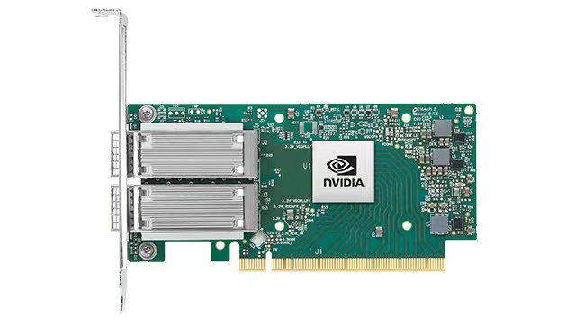
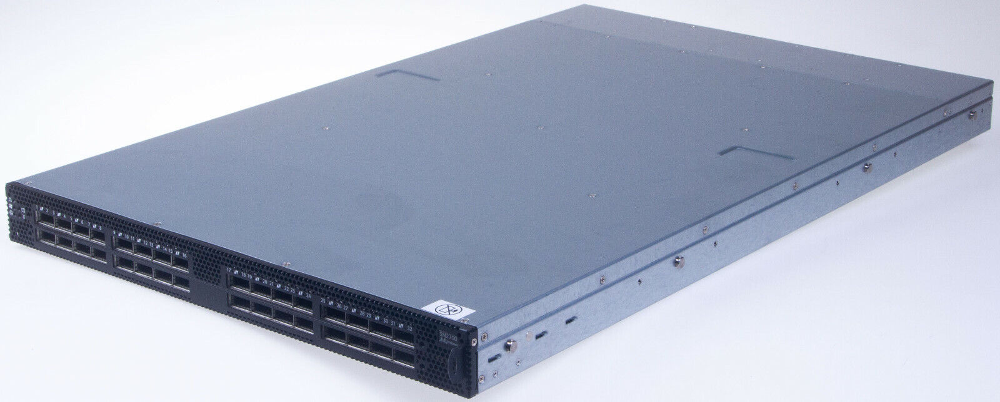
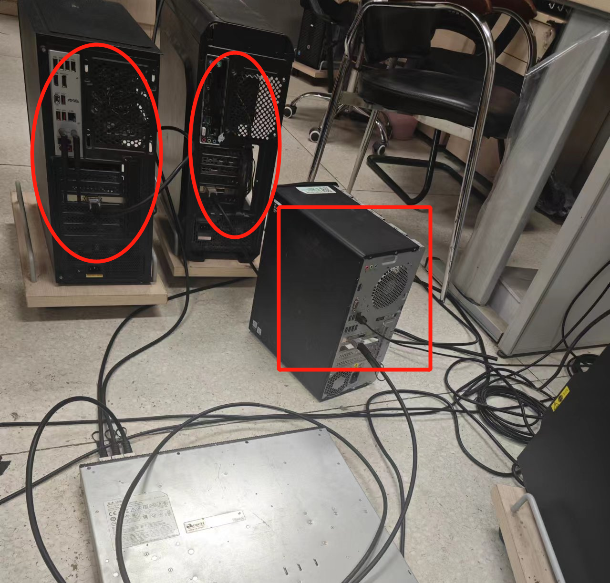

# 构建基于RDMA的多节点异质内存系统 multiswap
赛题：proj309

RDMA是一种新型网络技术，CPU可以通过Infiniband RDMA网卡设备对连接的另一个设备上的内存发起访问。我们希望通过RDMA网卡、RDMA交换机构建一个3-5节点的原型系统。该系统应拥有2-3个远程内存节点和1-2个计算节点，我们希望可以在Linux内核层面，探索未来如何在更复杂RDMA拓扑连接上实现更高性能的内存池系统。


# 参赛队伍简介
学校： 南开大学

队长： 曹骜天

队员：朱奕翔、许宸

项目导师：宫晓利

# 项目简介
随着内存需求的不断增长，远程直接内存访问（RDMA）技术的引入为解决内存不足问题提供了一种可行的方案。RDMA允许一台机器直接访问另一台机器的内存，在系统内存不足时，可以利用远程内存进行数据交换，从而扩展本地资源。尽管Compute Express Link（CXL）技术也具备广阔的前景，但基于RDMA的交换机制由于其良好的兼容性，使得现有软件无需修改即可使用，因此在未来的计算机数据中心中仍将广泛存在。在这种背景下，通过RDMA所实现的远程内存池服务可以由多个内存节点同时提供，并且这些内存节点由于资源分配、内存效率、带宽预留以及节点内存带宽压力等因素的不同，可能存在性能差异。因此，如何在多个内存池节点中合理选择目标内存池进行内存交换操作变得尤为重要。

为了解决上述问题，我们首先利用Linux中swap子系统对多设备的原生支持和frontswap的可扩展性，基于RDMA实现了远程内存页面传输协议。而后构建了多节点混合远程内存池系统MultiswapSys。该系统是一个拥有计算节点和两个内存节点的内存池集群，用于模拟数据中心中部分机器存在闲置内存的情况。最后通过实验进行流量监测与控制，分析了各个内存节点在不同带宽下系统的性能表现，并在计算节点上实现了的页面调度策略，通过为每一个换出的页选择合适的内存节点，显著提高了混合远程内存池系统的性能。


基于上述搭建的系统环境，我们分为了系统实现正确性与有效性两方面进行测试。在正确性测试方面，我们让负载产生内存压力以强制触发swap机制，证明了所实现远程内存节点的正确性。在有效性测试方面，我们首先在不限制带宽的情况下使一个计算节点匹配一个或两个内存节点分别进行测试，将特定工作集运行时长缩短了50%以上，同时在Kmeans、tensorflow等十分具有现实意义的测试集上进行相同测试，使其性能也获得了显著提升。然后对两个内存节点的带宽做了不同的限制，针对测试集运行稳定时每秒的吞吐量以及运行总时间，通过实现页面调度策略，成功地将在带宽限制下的系统性能提升了25%以上。最后以此说明了我们本项研究工作的必要性，为未来大规模数据中心和高性能计算环境中的远程内存技术应用提供了有价值的参考。

### 项目开发设计文档
[项目设计文档](https://gitlab.eduxiji.net/T202410055992676/project2210132-233922/-/blob/dev-rdma/开发文档.pdf)

# 硬件支持
第五代RDMA网卡：Nvidia Mellanox ConnectX-5 RoCE



以太网交换机：NVIDIA Mellanox SN2700


# 开发环境
|     | Linux kernel  | Nvidia MLNX OFED driver  | OS  |
|:---------:|:--------:|:--------:|:--------:|
| **计算节点**   | 6.1.87  | 23.10-3.2.2.0-LTS  | Ubuntu 22.04  |
| **内存节点**   | 5.15  | 5.8-4.1.5.0-LTS  | Ubuntu 20.04  |
| **交换机**   | 6.1.0  | ---  |  Cumulus Linux 5.9  |

# 系统架构
我们最终构成的系统由三台主机构成，也就是拥有三个节点。其中一个节点为计算节点，剩余为远程内存节点。将计算节点与内存节点安装上ConnectX-5 RoCE网卡后与交换机进行连接，交换机将会转发它们的流量，使三者能够互相访问。下图为我们搭建的系统实物图，图中椭圆所标识位置为内存节点，方框所标识位置为计算节点，最下方为以太网交换机。



**License**
- GPLv2 (https://www.gnu.org/licenses/old-licenses/gpl-2.0.en.html)

### 项目目录
```shell
├─ 6.1kernel        # submodule:增加补丁后的Linux6.1内核
├─ dev-rdma         # RDMA驱动，计算节点配置
│  ├─ Makefile       
│  ├─ insdram.sh     # 安装DRAM BACKEND
│  ├─ insmod.sh      # 安装RDMA BACKEND
│  ├─ multiswap.c    # multiswap
│  ├─ multiswap_dram.c  # DRAM BACKEND
│  ├─ multiswap_dram.h
│  ├─ multiswap_rdma.c  # RDMA BACKEND
│  ├─ multiswap_rdma.h
│  ├─ rmdram.sh      # 移除DRAM BACKEND
│  └─ rmmod.sh       # 移除RDMA BACKEND
├─ farmemserver     # 远程内存服务端，远程内存节点配置
│  ├─ Makefile
│  └─ rmserver.c    
├─ switch            #交换机配置
├─ test     # 测试相关
│  ├─ memory_limit_test.sh  # 测试正确性脚本
│  ├─ pagewalker.c      # 测试正确性程序
│  ├── data_test        # 性能测试脚本
│  ├── averagetime      # 数据处理后结果
│  ├── plot 
│  ├── testbench     # benchmark
│  │   ├── kmeans     
│  │   ├── quicksort
│  │   ├── linpack
│  │   ├── mbw      
│  │   ├── stream
│  │   └──tensorflow
│  └── testoutcome # 测试结果原始数据
└─ User        #用户态RDMA连接建立程序  
   ├─ client.c
   ├─ Makefile
   └─ server.c
```

