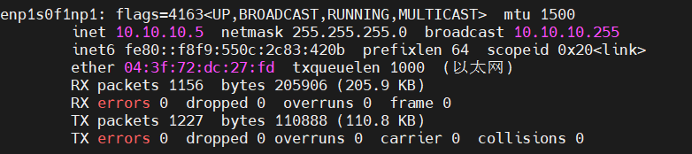
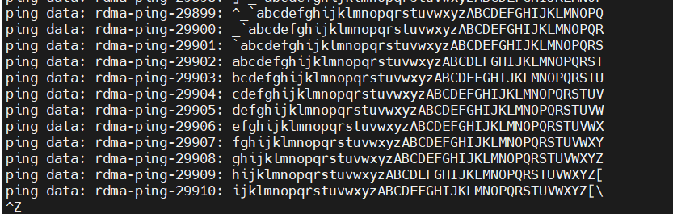

# 总体描述
在我们所实现的系统中，环境配置包括对计算节点、内存结点、交换机的环境配置。**在进行配置之前，需要将主机插上RDMA网卡并使用连接线缆进行连接。**

我们采用的网卡为Mellanox ConnectX-5 RoCE，交换机为型号为Nvidia Mellanox SN2700

## 计算节点环境配置

### 安装修改后的内核
在项目的仓库目录6.1kernel中，跳转到我们增加补丁后的Linux6.1内核，下载该内核，进入该文件夹后，执行以下命令：
```shell
make menuconfig
```
将进入Linux内核配置界面，我们选用默认配置，不做任何修改，直接保存退出。现在会发现，在目录下多了一个.config文件，这个文件就是我们的内核配置文件，接下来我们需要修改该配置文件，找到CONFIG_SYSTEM_TRUSTED_KEYS与CONFIG_SYSTEM_REVOCATION_KEYS，将这两者置为空：
```shell
CONFIG_SYSTEM_TRUSTED_KEYS=""
CONFIG_SYSTEM_REVOCATION_KEYS=""
```
保存退出，然后执行以下命令编译内核：
```shell
make -j6
sudo make modules_install
sudo make install
```
其中-j6是因为我们只有6个核心，可以根据自己的CPU核心数进行调整。编译完成后，进入/etc/default/grub文件，找到GRUB_TIMEOUT=0，将其改为GRUB_TIMEOUT=10，保存退出，然后执行以下命令：
```shell
sudo update-grub
```
更新grub完毕后，重启系统，会进入grub，选择刚才安装的新内核启动即可。可以输入以下命令查看内核版本：
```shell
uname -r
```


至此，计算节点内核安装完毕。

### 安装Nvidia MLNX OFED 驱动
**驱动版本一定要使用我们所选择的！！！**

进入[官网](https://network.nvidia.com/products/infiniband-drivers/linux/mlnx_ofed/)，选择图示的tgz压缩包版本进行下载：

解压后进入压缩包目录，执行以下命令：
```shell
sudo ./mlnxofedinstall --force-dkms
```
若此时安装过程卡住或者失败，可能因为系统中存在一些事先安装但是版本不对的库，可以执行卸载命令后再次安装：
```shell
sudo ./uninstall.sh
```
此过程需要10-20分钟，请耐心等待。安装完成后，若无报错，则执行以下命令重启服务：
```shell
sudo /etc/init.d/openibd restart
```

此时如果本机拥有RDMA网卡，则可以执行以下命令查看网卡信息：
```shell
ibstat
```


图示说明网卡拥有两个接口，其中一个接口为连接状态，即指示灯为绿色。接着可以进行简单测试：
```shell
sudo  hca_self_test.ofed
```


可以看到安装OFED驱动的版本，以及测试结果均为PASS，且网卡有一个接口处于连接状态。

### 为网卡设备配置IP地址
输入命令查看网卡接口对应的网络设备名称：
```shell
ibdev2netdev
```


找到Up状态的网卡接口，记住其对应的网络设备名称，例如此时为enp1s0f1np1，然后配置ip，在示例中我们将其ip配置为10.10.10.5。执行以下命令：
```shell
sudo ifconfig enp1s0f1np1 10.10.10.5 netmask 255.255.255.0
```
然后执行以下命令查看配置结果：
```shell
ifconfig
```


可以看到ip被成功配置。至此，计算节点环境配置完毕。

## 内存节点环境配置
内存节点不需要修改内核，只需要安装OFED驱动并且配置ip即可。我们的内核节点使用操作系统版本为Ubuntu 20.04，使用5.15自带内核。

### 安装OFED驱动
大致过程一致，除了下载的驱动版本不同。进入[官网](https://network.nvidia.com/products/infiniband-drivers/linux/mlnx_ofed/)，选择图示的tgz压缩包版本进行下载：


其余步骤与计算节点一致。

### 配置ip
我们拥有两个内存节点，使用相同的配置方式为网络设备配置ip为10.10.10.1与10.10.10.7。

## 测试配置
在计算节点与内存节点配置完成后，可以测试两个节点间是否联通。未使用交换机时，我们可以将两个主机的RDMA网卡接口直接连接在一起。由于使用RoCE网卡，其具备普通网卡的功能，即在两个设备间可以互相访问。


我们可以在内存结点执行以下命令：
```shell
sudo systemctl enable ssh
sudo systemctl status ssh
```
将内存节点开启ssh服务并检测。此时，计算节点可以通过刚才配置的ip访问内存节点：


说明此时的网卡连接通畅。并且今后可以使用计算节点远程操作内存节点。

接着测试两端是否能够成功建立RDMA连接，使内存节点作为服务端，计算节点作为客户端尝试建立RDMA连接，依次运行命令：
```shell
#server node
rping -s -a 10.10.10.1
#client node
rping -c -a 10.10.10.1 -v
```
若此时两端能观察到


有不断输出的ping data，说明能够建立RDMA连接。至此，两节点配置完成。

## 交换机配置
### 1 SN2700交换机配置

由于 Culumus Linux 4.7 并不兼容现有的 RDMA 网卡，我们需要将其手动升级至 Cumulus 5.9 版本。

首先，用 USB 转 DB9 的 console 线连接 SN2700 的 console 接口和电脑的 USB 口，用串口连接 交换机。串口连接的配置配置如下：

| Parameter    | Setting |
| ------------ | ------- |
| Baud Rate    | 115200  |
| Data bits    | 8       |
| Stop bits    | 1       |
| Parity       | None    |
| Flow Control | None    |

默认开机后会进入 ONIE 平台，选择第一个选项”Install OS”：


默认 ONIE 会自动寻找脚本去自动安装，等待进入 ONIE 界面，使用如下命令让 ONIE 停止自动发现脚本的行为：

````bash
onie-stop
````


将启动盘插入 SN2700 的 USB 口（下图中的红框端口，建议将 U 盘格式化成 fat32 格式）：


在 onie 运行命令：

````bash
fdisk -l
````

查看 USB 的 disk 目录名，一般为`/dev/sdb1`。运行下面的挂载命令将 USB 设备挂载交换机本地的`/mnt/usb `目录：

````bash
mount /dev/sdb1 /mnt/usb
````


进入`/mnt/usb` 目录，将`cumulus-linux-5.9.0-mlx-amd64.bin`文件拷贝到`/tmp` 目录下，此时可 以将 USB 拔出。 

1 分钟后交换机会自动重启并进入下面菜单，此时无需操作，等待其进入安装即可：


进入约 15 分钟的安装过程（该过程无需任何操作）：


安装完成后，会进入图5.39所示的 login 画面，第一次登陆的默认用户名是与密码均为 cumulus，登陆成功后会进入密码更新界面：


更新密码，Cumulus Linux 刷机完成。


若观察到 RDMA 网卡指示灯正常，那么证明连接成功，可以开始配置桥接等工作。


### 2 配置桥接

使用如下的命令配置所有端口的桥接：

````bash
nv set interface swp1 -32 bridge domain br_default access 100
nv set interface swp1 -32 link state up
nv set system config auto-save enable on
nv config apply -y
````

现在可以开始为各个节点分配 ip，该步骤在各机器的操作系统上进行配置，这里不多赘述。 

在交换机上运行下面的指令查看配置文件，若机器型号相同，则配置文件应该与仓库中中所给出的配置文件完全一致：

````bash
sudo nano /etc/network/interfaces
````

在配置端口后，我们需要配置网络接口的 QoS（服务质量）设置：启用 RoCE 的 QoS 配置，并将 RoCE 模式设置为无损模式。使其在传输过程中不会产生丢包，适用于对延迟和数据完整性要求较高的场景。接着，为默认的有损流量池分配 10% 的内存。这些流量在拥塞时可能会被丢弃。最后为 RoCE 无损流量池分配 90% 的内存，些流量在传输过程中不会丢包，能够确保数据的完整性和低延迟。

运行如下的指令配置 RoCE：

````bash
nv set qos roce enable on
nv set qos roce mode lossless
nv set qos traffic -pool default -lossy memory -percent 10
nv set qos traffic -pool roce-lossless memory -percent 90
nv config apply -y
````
